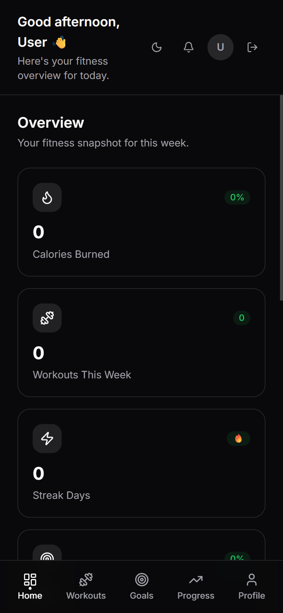
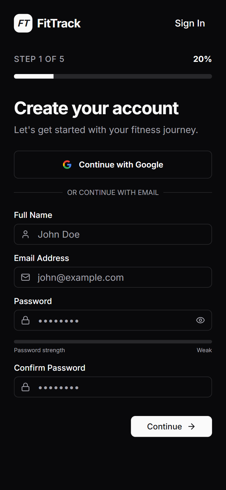
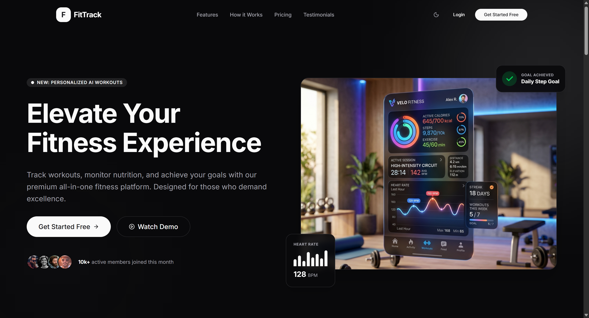
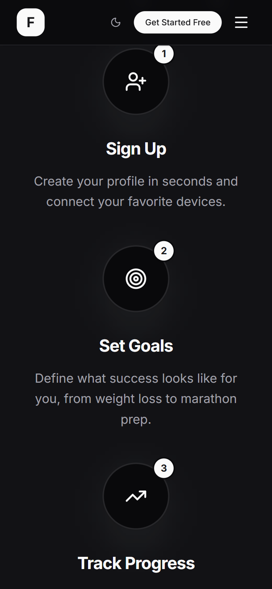

# FitTrack - Personal Fitness Dashboard



## What We Built

FitTrack is a modern fitness and wellness web app built with Next.js App Router, Tailwind CSS, and shadcn/ui.

The project includes:

- **Premium Landing Page**: Modern, animated hero and feature sections.
- **5-Step Onboarding**: Personalized profile setup and goal tracking.
- **Dynamic Dashboard**: Real-time stats, weekly activity charts, and workout tracking.
- **Full-Stack Integration**: Express.js backend with MongoDB and JWT Auth.
- **Responsive Design**: Optimized for mobile, tablet, and desktop.
- **Dark/Light Mode**: Full theme support across all pages.

---

## App Gallery

### Desktop Experience
| Dashboard Overview | Onboarding Flow |
| :---: | :---: |
|  |  |

### Landing Page


### Mobile Responsive


---

## Tech Stack

**Frontend:**
- Next.js 15 (App Router)
- TypeScript
- Tailwind CSS
- Framer Motion
- shadcn/ui
- Axios

**Backend:**
- Node.js & Express.js
- MongoDB & Mongoose
- JSON Web Tokens (JWT)
- bcryptjs

---

## Features

- **Auth & Onboarding**: Secure registration and profile persistence.
- **Data Persistence**: MongoDB stores user profiles, preferences, and activity.
- **Smooth UX**: Framer Motion animations and skeleton loading states.
- **Interactive Charts**: Weekly activity visualization using Recharts.

---

## Setup

### Frontend & Backend
Run both servers concurrently from the root directory:
```bash
npm install
npm run dev
```

### Environment Variables
Create a `.env` file in the root and `/backend` directory:
```env
MONGODB_URI=your_mongodb_uri
JWT_SECRET=your_secret_key
NEXT_PUBLIC_API_URL=http://localhost:5000/api
```

---

## Design Inspiration

- Dribbble & Mobbin
- Tailwind UI
- shadcn/ui
